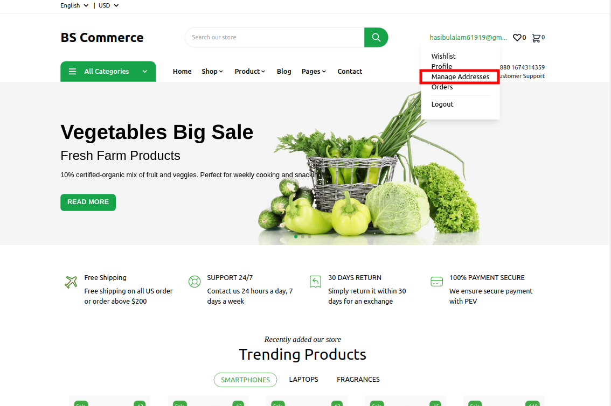
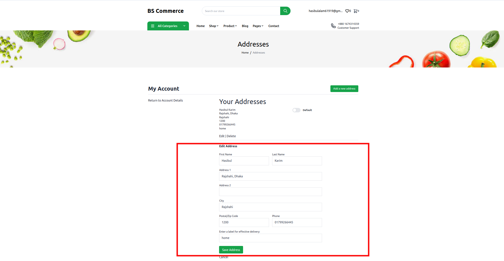

# Manage Shipping Address

If the User is Logged in , then the 'methodanage Address' option of the user will be showed in the third option

## Add New Address

User Will have an option to add New Adress by clicking the button **Add a new address** where the First name , Last Name , Address 1, Address 2 , City Postal/Zip Code , Phone and a Habel ( eg- Home , Office, etc ) is required

## Add New Address

Click the Button on the right most corner as **Add a new address**
The following form will be visible

## Edit New Address

User is also allowed to edit an exisiting address

## Delete Existing Address

There will also be an option to set an address as default one as follows

