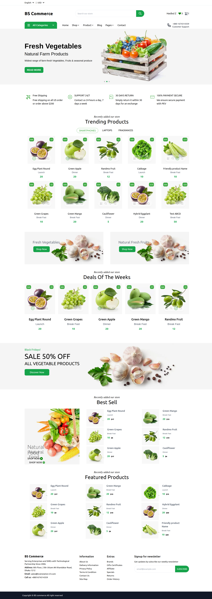
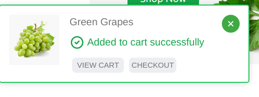
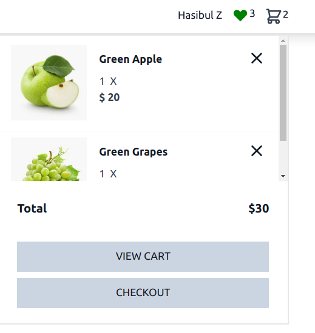
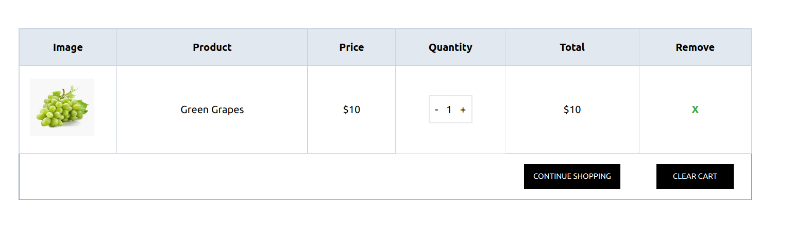
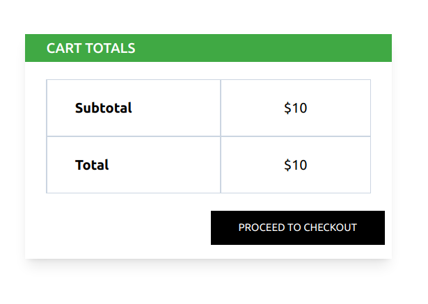

# How to Add Product to the Cart

The Storefront runs at **3002** and visit **localhost:3002/** route for Visiting Home Page :

:::tip Visit the Storefront

Visit localhost:3002
:::

## Adding Product To Cart From Home Page

In the Home Page There are a list of Products From Where you can add to Cart, just hover over the product card and click the **cart icon** , if the Product is not added to the cart it will automatically be added to the cart

After the Successful addition of Product , A Success Modal will be shown

## Visiting Cart Page to View the Product

You Can Visit the cart Page both by

1. Clicking the **View Cart** Button as well as the Product can be Viewed from the Header Cart Dropdown Section
   

2. Click the **VIEW CART** Button which would Redirect you to the Cart Page

3. Visiting the Route **localhost:3002/cart**

From the Cart Page you can Increase or Decrease the Product Quantity as well as Remove it

View the Cart total from the Table Below

