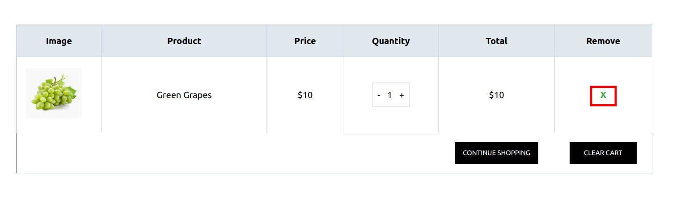

# How to Add Product to the Cart

The Storefront runs at **3002** and visit **localhost:3002/** route for Visiting Home Page , You can add Product to the cart by two ways

1.From the Product card

2.From the Product Details Page

:::tip Add Product to the Cart

1.Visit localhost:3002

2.Click the Cart Icon from the Product Cart3

3.Go to the Product Details then Click the ' Add to Cart ' Button
:::

## Adding Product To Cart From Home Page

In the Home Page There are a list of Products From Where you can add to Cart, just hover over the product card and click the **cart icon** , if the Product is not added to the cart it will automatically be added to the cart

After the Successful addition of Product , A Success Modal will be shown

## Adding Product To Cart From Product Details Page

Click on the Product Name from the Product card o to go to the product details Page

Or Hover over the product image , and Click the 'Search Icon' which will also take you to the Product details Page

## Visiting Cart Page to View the Product

You Can Visit the cart Page both by

1. Clicking the **View Cart** Button as well as the Product can be Viewed from the Header Cart Dropdown Section
   

2. Click the **VIEW CART** Button which would Redirect you to the Cart Page

3. Visiting the Route **localhost:3002/cart**

## Cart Page Details

When You Naviagate the Cart Page You can view the Preview Below

You Can also go back to the Particular Product detail of the Cart Page

From the Cart Page you can Increase or Decrease the Product Quantity as well as Remove it

You can also remove a Particular Product from the Cart Page

There is also an option to clear the whole cart

After Clearing the whole Cart there will be an empty Preview

View the Cart total from the Table Below

