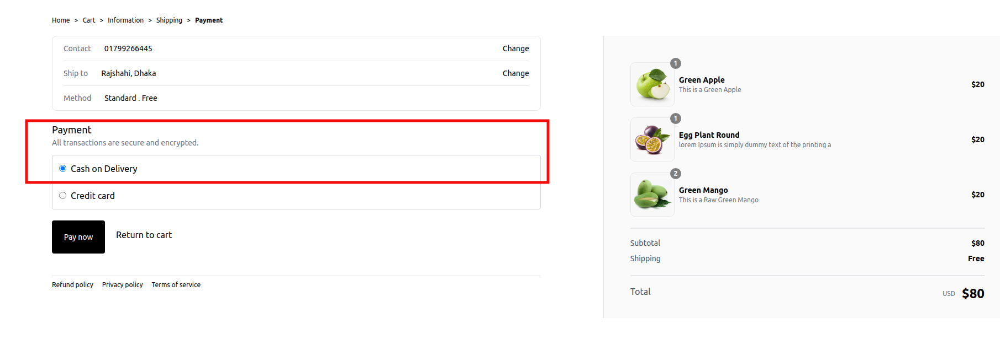

# Checkout And payment

Checkout and Payment section has twpo sections namely

1. Cart Products

2. Shipping Address

3. Shipping Method

4. Payment

After adding particular products to the cart there is an option to checkout , On Clicking the **PROCEED TO CHECKOUT** Button from the Cart Total Section ,it will be redirected to the [http://localhost:3002/checkout](http://localhost:3002/checkout) page

## Checkout Page

On Redirecting to the checkout page the user can navigate through the sections as shown below

## Cart Products

On the Right Side of the Checkout Page the Products which User added and wants to order are shown along with the details

## Shipping Address

On the Shipping Address Section there is a dropdown which allows user to Select Adress from the saved ones. If there is no Pre-Saved Address an user can add new address also , Please Note that User Can also add Address from
** Manage Address ** Sectio also which is visible from the link
[http://localhost:3002/myAccount/addresses](http://localhost:3002/myAccount/addresses) , a complete tutorial can be found at the following section

After Selecting or Adding shipping Informations , User will be allowed to click 'continue to shipping' button , user can also go back to the cart page by clicking 'Return to cart' button.

## Shipping Method

User is allowed to select shipping method by default which is shown as 'Standard'
After Selection of the shipping method there are options to go back to the Information page section or Payment section by clicking 'Return to information' and 'Continue to payment' buttons

## Payment

After Selecting ** Continue to payment ** option the user will be allowed to choose the payment options

In the Payment section user is allowed to select **'Cash on Delivery'** and **'Credit Card'** options by default where **'Cash on Delivery'** is selected

If the User Selects **'Cash on Delivery'** option and clicks **"Pay now"** button , the Order will be proceeded and user will be landed to the Success Order Page if everything is Fine

If the User Wants to Complete the Payment by selecting **'Credit card'** option then the Card Number, Name on card, Expiration Date (DD/ YY) and Security Code will be asked to give

User will still be allowed to Return to the cart page

After Clicking the **Pay now** Button user information of Order will be stored and after validation user will be allowed to Proceed

After Successfull order Place user will be redirected to the success page

User can Navigate and View the Order Summery by Clicking

