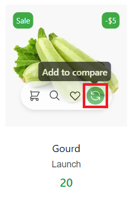
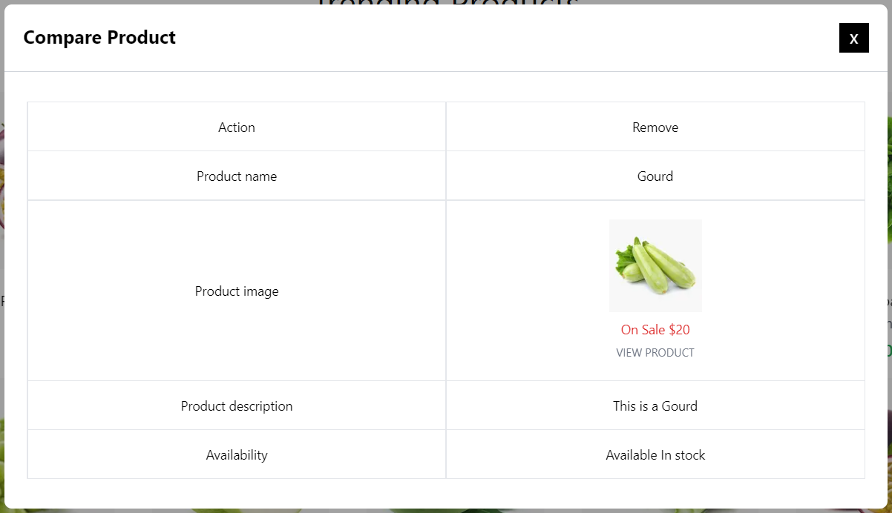
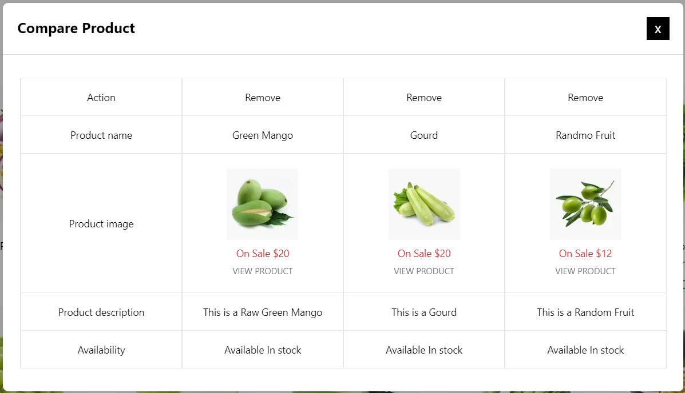
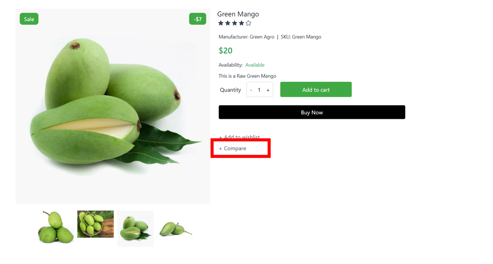
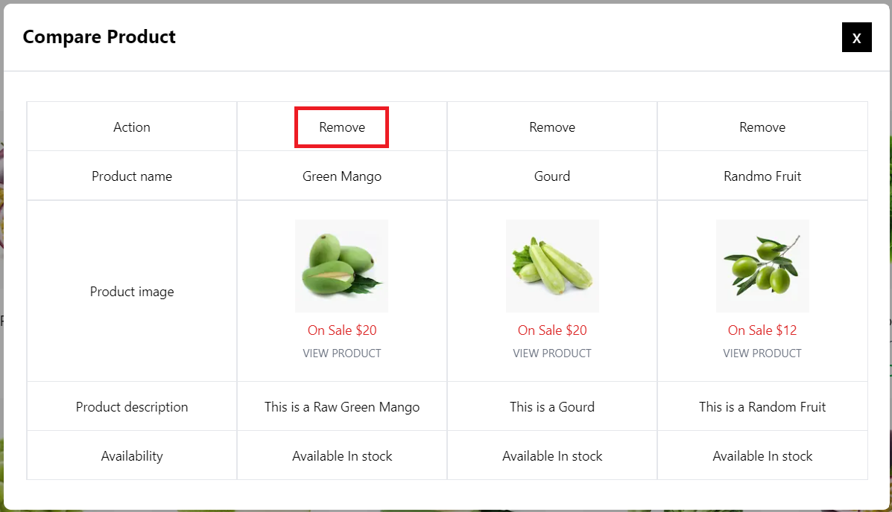
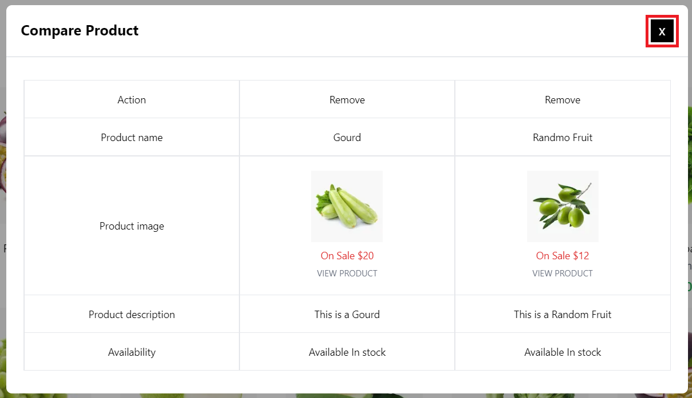

# Compare Products

## How to Add Product Compare

The Storefront runs at **3002** and visit **localhost:3002/** route for Visiting Home Page , You can add a Product to **Compare**

1.From the Product card

2.From the Product Details Page

:::tip Add Product to Compare

1.Visit localhost:3002

2.Click the **Compare Icon** from the Product Card

3.Go to the Product Details then Click the **Compare** Button
:::

## Add Products To Compare From Home Page

In the Home Page if you hover over any product, you can see four icons. Click on the **Compare** icon to add a product to the compare list.

After the Successful addition of Product , A Compare Modal will be shown.

You can add up to three items to compare. Adding a fourth will automatically discard the first item on the list.

## Add a Product To Cart From Product Details Page

You can also add a product to the Compare list by clicking on the **Compare** button from the Product Details page.

## Remove an Product From Compare

Click on the **Remove** button on the top of the modal to remove a product from the Compare list.

## Close Compare Modal

Click on the close **(X)** button to close the compare modal.

