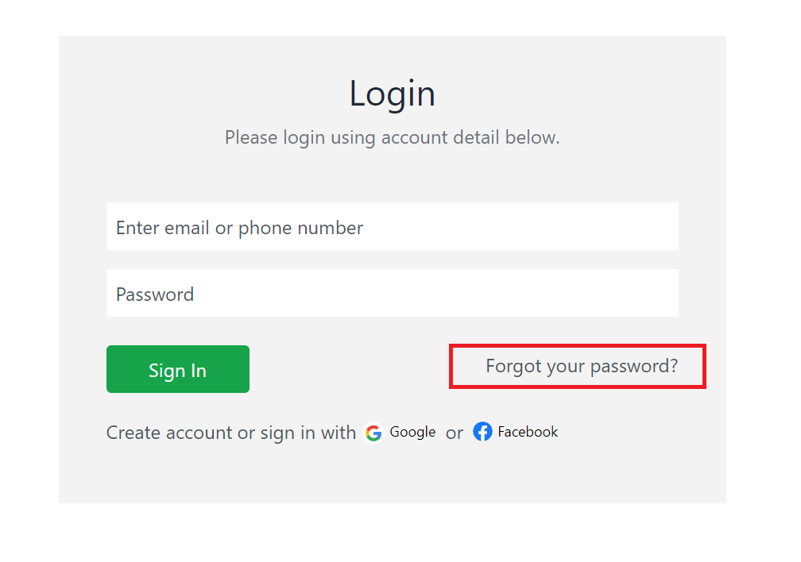
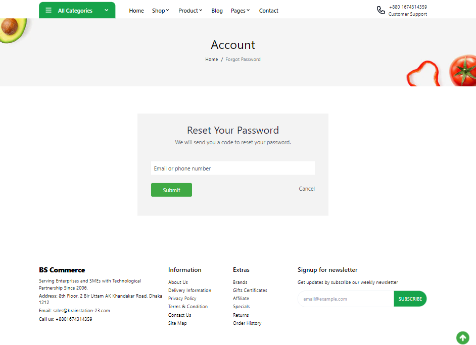
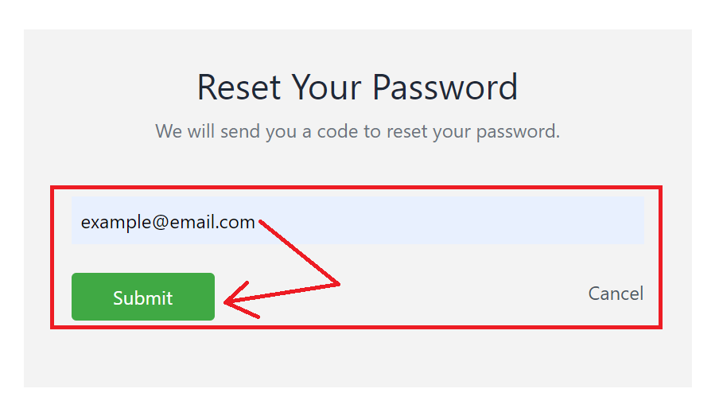
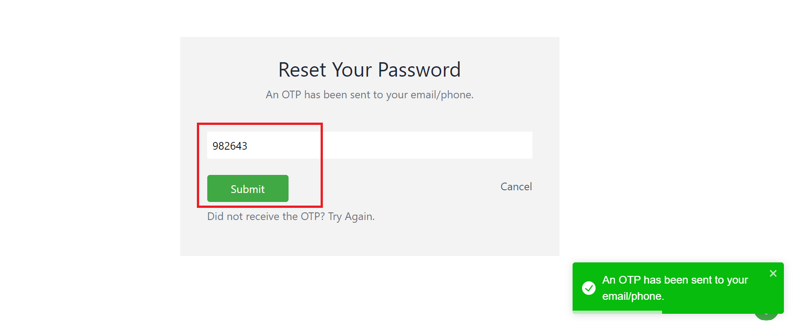
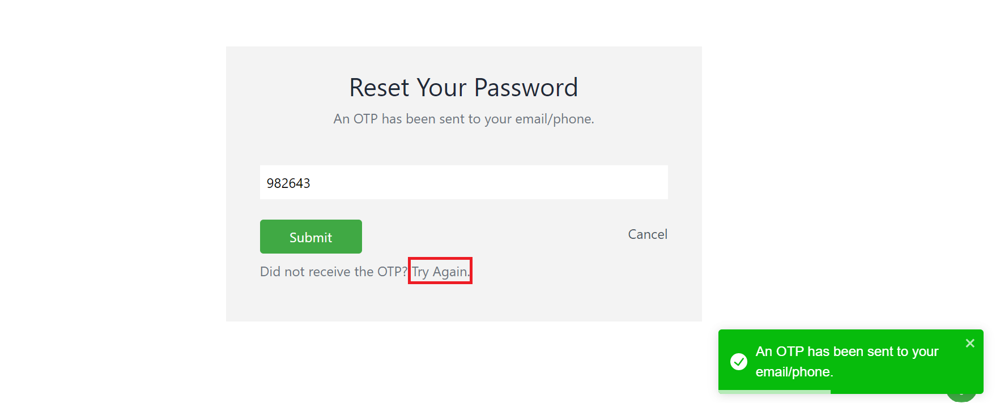
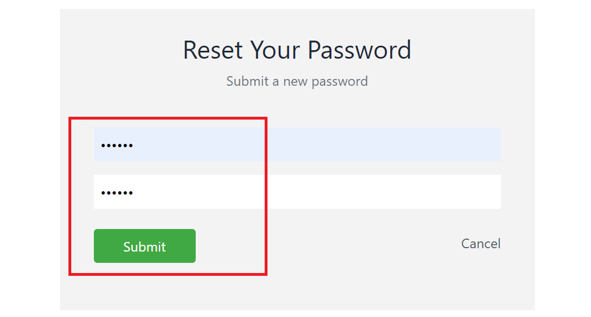

# Forget Password

The Storefront runs at **3002** and visit **localhost:3002/** route for Visiting Home Page. If you forget your password, you can reset it using our **forgot password** feature from login page at **localhost:3002/account/sign-in**.

Clicking the above button will redirect you to **localhost:3002/account/forgot-password** page which looks like below

Enter your **registered email/phone number** and click submit.

An **OTP** will be sent to your email/phone number. Type that OTP in the field below.

If you did not receive the OTP, click **Try again**.

After verifying OTP, type your new password and submit the form.

After reseting your password, you will be redirected to login page. Use your new password to login then.
