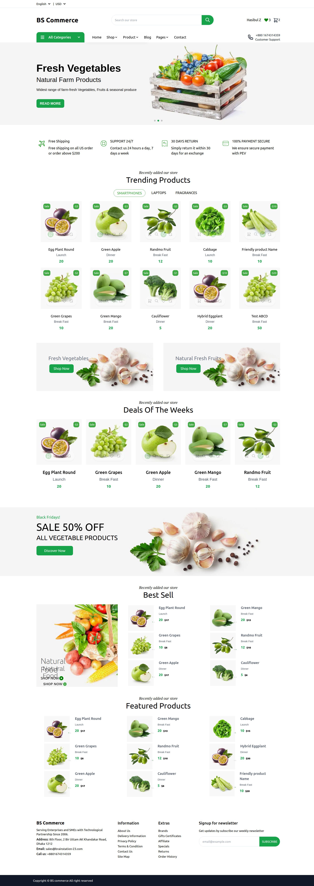
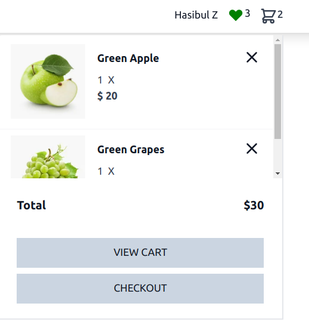

# Visiting Homepage

The Storefront runs at **3002** and visit **localhost:3002/** route for Visiting Home Page

:::tip Go to Homepage

1.Visit localhost:3002

:::

You will get the following Preview from the Homepage

## Homepage Sections

Our Homepage has the following Sections

1.Navbar

2.Banner

3.Product Criterias

4.Trending Product Sections

5.Deals of the week Section

6.Best sell Section

7.Featured product Section

## Navbar

Navbar has the following segments

1. **Service Header**

   In the Service header section the Name of the icon is showed by clicking in which we can come back to the home page or the root route
   

2. **Search Options**

   Search options indicates the availability to search product in which user can search any product which will be later showed down by matching any keywords
   

3. **Username in which the user is logged in**

   If the User is logged in the Username will be displayed , if not a login/signup options will be shown
   

4. **Wishlist segment icon**

   The wishlist icon allows user to go to the wishlist page , if any item is selected as a wishlist it will be reflected there
   

5. **Cart segment icon**

   Cart Segment icon indicates the number of products in the cart of an user,in the left side the number of products in the cart will be shown , user can click to this icon to view the cart items from the cart dropdown as well as user can go to the cart page and checkout page by clicking the 'VIEW CART' and 'CHECKOUT' buttons
   

   OnClicking Over the Cart Icon there will be a dropdown which will make the cart products visible under a dropdown
   

   Click to [http://localhost:3005/docs/tutorial-basics/Tutorial-storefront/add-to-cart](http://localhost:3005/docs/tutorial-basics/Tutorial-storefront/add-to-cart) to get more detailed update rregarding adding product to the cart

## Banner

In the whole Home Page there are few banners which is visible throughout the home page , the main purpose of this Banners are to tell the user about the different offers and exclusive deals
The First banner is a slider

the second banners are static ones implying users about the exclusive deals

## Service Criterias

Below the Banner there is a section implying the exclusive services which are being provided

## Trending Product Sections

The Trending product section is a slider which Displays all the Trending Products in one section

## Deals of the week Section

Deals of the Week section shows all the products on deal under one section

## Best sell Section

Best Sell section shows all the products which are top sell under one section

## Featured product Section

There is a Fetured Product section indicating all the exclusive contents under one section

## Footer

The footer section shows all the contents in the footer

