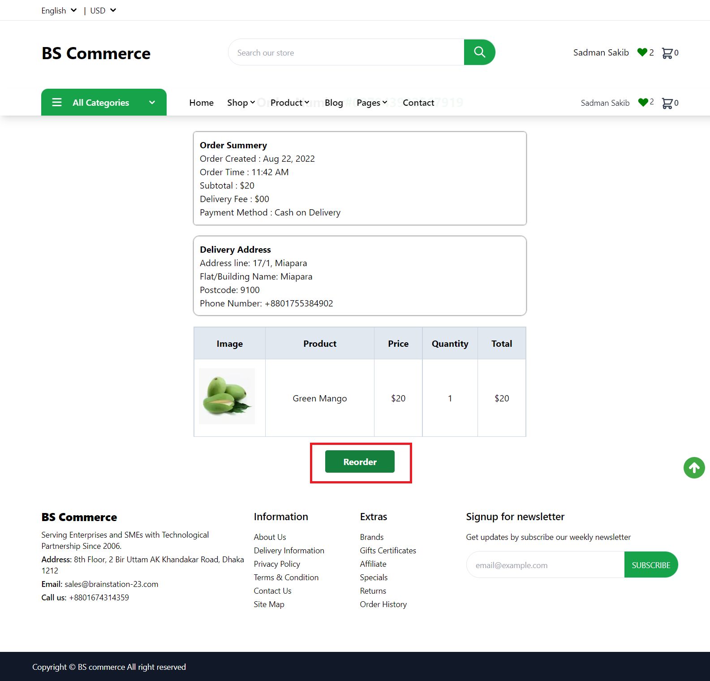

# How to Reorder

The Storefront runs at **3002** and visit **localhost:3002/** route for Visiting Home Page.

## Visit your previous Orders
To reoder one of your previous orders you need to, first, go to the order page. Hover over your name or email id to see the profile dropdown menu and select Orders from there.

You will see a list of all of your previous orders.

Click on the **Details** button to see the order details.

In the order details page you can see your shipping address, billing address and the products that you ordered. To re-order the item(s) again, click on the **Reorder** button 
You will see a pop-up asking you to confirm whether you want to reorder or not.

Clicking **Yes** will add the product(s) to cart if they are available and take you to the cart page. From there you can checkout to place the order again.

You can check **How to place order** from here:

