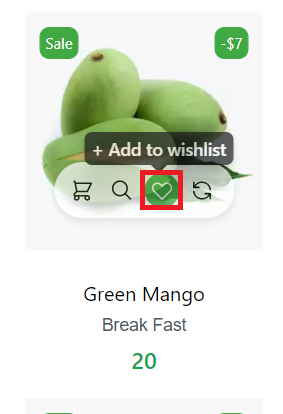
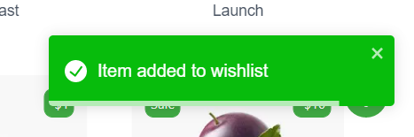
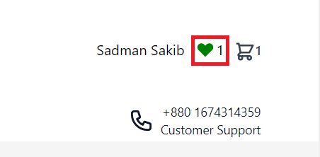
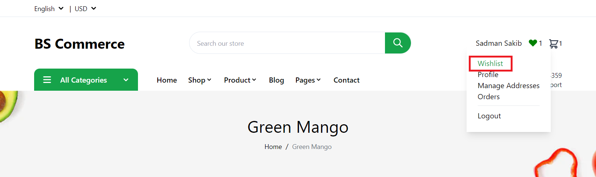
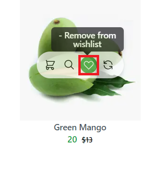

# How to Add Product to the Wishlist

The Storefront runs at **3002** and visit **localhost:3002/** route for Visiting Home Page , You can add Product to the wishlist

1. From the Product card

2. From the Product Details Page

:::tip Add Product to the Wishlist

1.Visit localhost:3002

2.Click the 'Add to wishlist' Icon from the Product Card

3.Go to the Product Details then Click the ' Add to wishlist ' Button
:::

## Add Product To Wishlist From Home Page

In the Home Page there is a list of products from where you can add product(s) to Wishlist. To add a product to wishlist, hover over the product card and click the **Add to Wishlist** icon. The product will be added to the wishlist.

After the product is successfully added , a success toast will be shown

## Add Product To Wishlist From Product Details Page

You can also add a product to the wishlist from the product details page. Click on the **Add to Wishlist** button just below the Buy Now button to add the product to the wishlist.

## Visit Wishlist Page

You can visit the Wishlist page by

1. Clicking the **Wishlist** icon on the right side of the navbar,

   or

2. Click **Wishlist** from the dropdown menu. Hover over your name or email id to see the profile dropdown menu and select wishlist from there.
   

## Remove product from Wishlist

To remove a product from the wishlist simply hover on the product and find the **Wishlist** icon. If the product is already added to wishlist, this will now say *Remove from wishlist*. Click on the icon to remove the product from the wishlist.

You can also remove a product from the wishlist from it's details page. After you add a product to wishlist from the product details page, you will find the *Remove from wishlist* button. Click the button to remove the product from your wishlist.

